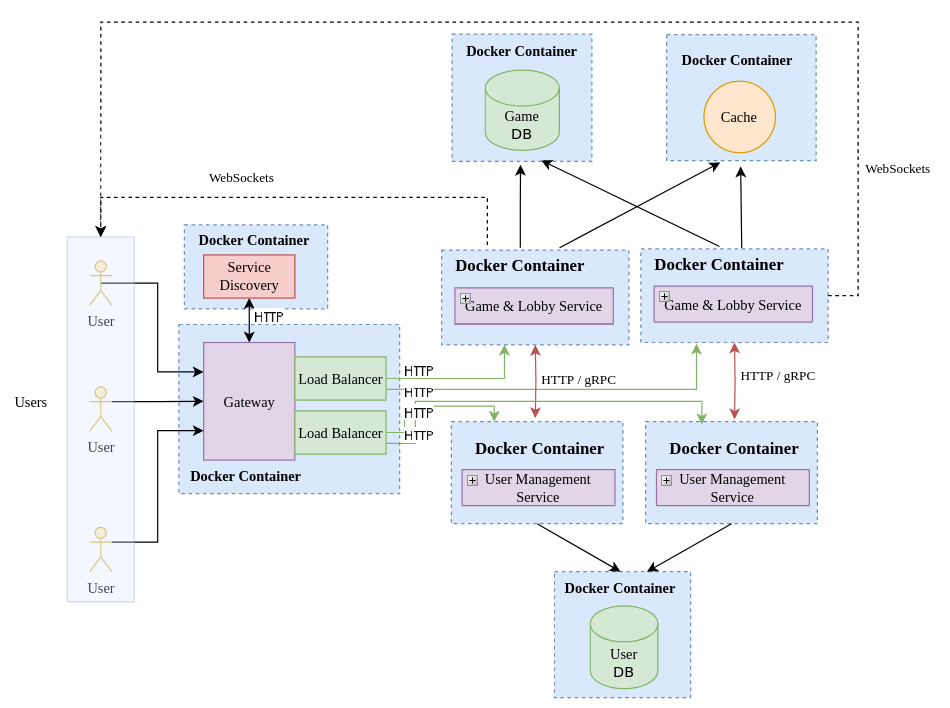

# 🤩 Online Poker Architecture 
Below is the the system design for an online poker game using microservices architecture.

## 🧩 Application Suitability

### Why Online Poker Game?
- **Popularity** - a globally popular game with a vast online audience bringing around 100 million players worldwide [[1]](#references)

- **Monetization** - real-money games, ads, and in-app purchases offer multiple revenue streams

- **Competitive gameplay** - the competitive nature of poker, with tournaments and rankings, will increase player's motivation and excitement


### Why do it through distributed systems?
- **Scalability** - as the user base grows, the system has
    to scale accordingly by increasing the resources available
    to perform faster and handle more users.

- **Reliability** - handle failures in individual components without
    affecting the entire system.

- **Flexibility** - add additional services (payment, analytics) without modifying the existing system much. 

### Real-world Examples
- **PokerStars** - one of the largest online poker platforms. The platform uses a microservices architecture to handle various aspects of the game, such as user authentication, game logic, and payment processing [[2]](#references).
- **GG Poker** - a popular online poker platform that uses a distributed messaging system to handle real-time interactions between players and game servers [[3]](#references).

## 🚧 Service Boundaries

### Game Logic & Lobby Management Service
- Game Logic
  - Deal and shuffle cards
  - Handle betting rounds, blinds, and raises
  - Validate hand rankings (from High Card to Royal Flush)
  - Manage player turns and pot distribution
  - Implement game state transitions (pre-flop, flop, turn, river)
  - Distribute rewards at the end of each hand or game session
- Lobby Management
  - Create lobby
  - List available lobbies 
  - Join and leave lobby

#### Boundaries
- **Encapsulation of poker logic** - all calculations and decisions related to the game state reside within this service
- **Lobby Independence** - communicate with other services (like User Management) for player data but remains independent in terms of handling table and game creation

### User Management Service
- Registeration and Login 
- Maintain user balances (chips)
- Handle monetary transactions (buy-ins, winnings)

#### Boundaries
- **Independence from Game Logic** - this service doesn't access to any poker logic, as it only provides user-related data like authentication status, profile, and balance
- **Clear Interface for Communication** - game service should interact with User Management via APIs to check for user credentials or adjust balances based on game outcomes.

### System Architecture


## 🖥️ Technology Stack & Communication Patterns

### Services
- Python
- Framework
  - Flask
- Database 
  - PostgreSQL
  - Redis 

### Gateway, Service Discovery, and Load Balancer
- Javascript (Node.js)
- Framework
  - Express.js 
  - Consul 

### Communication Patterns
- HTTP / gRPC for synchronous communication
- WebSockets for asynchronous communication

## 💾 Data Management

### Data Flow and Management across Microservices
- **User Management Service** - handles user-related data like authentication, user profiles, and balances. The balance of the user is managed here, which will be updated via APIs after game results are finished

- **Game Logic & Lobby Management Service** 
  - Manages game state and lobby interactions.
  - At the end of each game, the game service will need to send a request to the User Management service to update the players' balances based on the game outcome.

- **Data Transfer and Communication**
  - Synchronous (HTTP): For all user actions like registration, login, game creation, and player management. Services will communicate via RESTful APIs and transfer data in JSON format.

  - Asynchronous (WebSocket): For real-time game updates during active poker games, using WebSocket connections to push game state changes like bets, folds, or the end of the game to all connected players [[4]](#references).

### Game Logic & Lobby Management Service

#### GET `/status`
- Response
  ##### 200
  ```json
  {
    "status": "running"
  }
  ```
  ```json
  {
    "status": "stopped"
  }
  ```
  ##### 400
  ```json
  {
    "status": "error"
  }
  ```

### Lobby Management Endpoints
- Lobby Model
  ```
  lobby_id: integer,
  host_id: integer,
  max_players: integer,
  buy_in: float,
  players: List[User]
  ```
- `/lobby`
  #### POST `/lobby/create`
  - Request
    ```json
    {
      "host_id": "777",
      "max_players": "6",
      "buy_in": "5000",
    }
    ```
  - Response
    ##### 200
    ```json
    {
      "message": "Lobby created successfully",
      "lobby_id": "123"
    }
    ```
    ##### 400
    ```json
    {
      "message": "Invalid buy-in amount"
    }
    ```

  #### GET `/lobby`
  - Response
    ##### 200
    ```json
    {
      "lobbies": [
        {
          "lobby_id": "123",
          "max_players": "6",
          "buy_in": "5000",
          "players": [
            {
              "player_id": "777",
              "username": "Money_Maker_007",
              "balance": "1000"
            },
            {
              "player_id": "888",
              "username": "Bluff_Master_888",
              "balance": "2000"
            }
          ]
        },
        {
          "lobby_id": "456",
          "max_players": "6",
          "buy_in": "5000",
          "players": [
            {
              "player_id": "999",
              "username": "Poker_Pro_999",
              "balance": "3000"
            },
            {
              "player_id": "111",
              "username": "All_In_111",
              "balance": "4000"
            }
          ]
        }
      ]
    }
    ```
    ##### 404
    ```json
    {
      "message": "There are no lobbies available"
    }
    ```

  #### POST `/lobby/{lobby_id}/join`
  - Request (in URL)
    ```json
    /lobby/123/join
    ```
  - Request (body)
    ```json
    {
      "player_id": "777"
    }
    ```
  - Response
    ##### 200
    ```json
    {
      "message": "Player joined lobby successfully",
      "lobby_id": "123",
      "players": [
        {
          "player_id": "777",
          "username": "Money_Maker_007",
          "balance": "1000"
        },
        {
          "player_id": "888",
          "username": "Bluff_Master_888",
          "balance": "2000"
        }
      ]
    }
    ```
    ##### 400
    ```json
    {
      "message": "Lobby is full"
    }
    ```
    ##### 400
    ```json
    {
      "message": "Not enough balance"
    }
    ```
    ##### 404
    ```json
    {
      "message": "Lobby not found"
    }
    ```
  #### GET `/lobby/{lobby_id}/leave`
  - Request (in URL)
    ```json
    /lobby/123
    ```
  - Request (body)
    ```json
    {
      "player_id": "777"
    }
    ```
  - Response
    ##### 200
    ```json
    {
      "message": "Player left lobby successfully",
      "lobby_id": "123",
    }
    ```
    ##### 404
    ```json
    {
      "message": "Lobby not found"
    }
    ```
  #### GET `/lobby/{lobby_id}/start`
  - Request (in URL)
    ```json
    /lobby/123/start
    ```
  - Response
    ##### 200
    ```json
    {
      "message": "Game started successfully",
      "lobby_id": "123",
      "game_id": "456"
    }
    ```
    ##### 400
    ```json
    {
      "message": "Not enough players"
    }
    ```
    ##### 404
    ```json
    {
      "message": "Lobby not found"
    }
    ```

### Game Logic Endpoints
- Game Model
  ```
  game_id: integer,
  lobby_id: integer,
  players: List[User],
  pot: float,
  current_stage: string,
  current_player: user,
  community_cards: List[Card],
  player_cards: Dict[User, List[Card]],
  player_bets: Dict[User, float],
  ```
- `/game/{game_id}/updates (WebSocket)`
  #### Messages
  - `Player balance actions (bet, raise, fold, check)`
  ```json
  {
    "player_id": "777",
    "action": "bet",
    "amount": "500",
  }
  ```
  - `Player folds`
  ```json
  {
    "player_id": "777",
    "action": "fold"
  }
  ```
  - `Transition to next stage (pre-flop, flop, turn, river)`
  ```json
  {
    "current_stage": "flop"
  }
  ```
  - `Game end (showdown, winner)`
  ```json
  {
    "winner_id": "777",
    "winning_amount": "5000"
  }
  ```

### User Management Service Endpoints
#### GET `/status`
- Response
  ##### 200
  ```json
  {
    "status": "running"
  }
  ```
  ```json
  {
    "status": "stopped"
  }
  ```
  ##### 400
  ```json
  {
    "status": "error"
  }
  ```

- User model
  ```
  user_id: integer,
  username: string,
  password: string,
  balance: float
  ```

- `/users`
  #### `POST /register`
  - Request 
    ```json
    {
      "username": "Money_Maker_007",
      "password": "royal_flush_777"
    }
    ```
  - Response
    ##### 200
    ```json
    {
      "message": "User registered successfully",
      "user_id": "777"
    }
    ```

    ##### 400
    ```json
    {
      "message": "Username already exists"
    }
    ```


  #### `POST /login` 
  - Request 
    ```json
    {
      "username": "Money_Maker_007",
      "password": "royal_flush_777"
    }
    ```
  - Response
    ##### 200
    ```json
    {
      "message": "Login successful",
      "user_id": "777"
    }
    ```

    ##### 401
    ```json
    {
      "message": "Invalid credentials"
    }
    ```
  #### `GET /users/{user_id}`
  - Request (in URL)
    ```
    /users/777
    ```
  - Response
    ##### 200
    ```json
    {
      "user_id": "777",
      "username": "Money_Maker_007",
      "balance": "1000"
    }
    ```
    ##### 404
    ```json
    {
      "message": "User not found"
    }
    ```
  #### `PATCH /users/{user_id}`
  - Request (in URL)
    ```
    /users/777
    ```
  - Request (body)
    ```json
    {
      "balance": "999888777"
    }
    ```
  - Response
    ##### 200
    ```json
    {
      "message": "Balance updated successfully",
      "user_id": "777",
    }
    ```
    ##### 400
    ```json
    {
      "message": "Invalid balance"
    }
    ```
    ##### 404
    ```json
    {
      "message": "User not found"
    }
    ```
  

## 🚀 Deployment and Scaling

### Containerization
Each microservice will be containerized in separate Docker containers. This ensures that the services are isolated and can run in consistent environments, regardless of the host system, as you can use Docker Compose to manage multiple services. 

### Scalability
The scalability of Docker allows to efficiently manage and deploy containers at scale, as the number of containers and their resource requirements increase [[5]](#references), as you can manually scale services by running multiple instances of a Docker container on the same or different hosts. 

## References
1. Popularity of online poker, https://www.globalbrandsmagazine.com/how-many-people-play-online-poker/ 

2. Microservices Architecture for Gaming Industry
   Companies, https://fenix.tecnico.ulisboa.pt/downloadFile/1126295043838303/Extended_Abstract-SofiaEstrela-84186-22012021.pdf

3. GG Poker company information, https://playgg.ro/about-us

4. Building a Microservices Example Game with Distributed Messaging, https://blog.risingstack.com/building-a-microservices-example-game-with-distributed-messaging/

5. How can we build scalable backend architectures for poker game apps, https://sdlccorp.com/post/how-can-we-build-scalable-backend-architectures-for-poker-game-apps/
